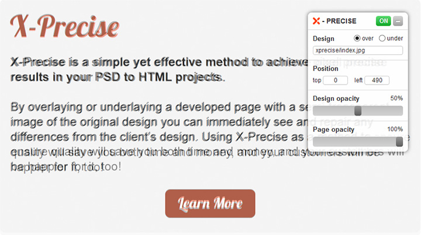

X-Precise
=========

X-Precise is a simple yet effective method to achieve pixel precise results in your PSD to HTML projects. By overlaying or underlaying a developed page with a semi-transparent image of the original design you can immediately see and repair any differences from the client’s design. Using X-Precise as a method to ensure quality will save you both time and money, and your customers will be happier for it, too!



## Demo

Check X-Precise demo [here](http://xhtmlized.github.io/x-precise/).

## Installation

X-Precise requires jQuery to run. Download [xprecise.min.js](xprecise.min.js) and attach it to the page.

```
<script src="http://code.jquery.com/jquery-1.11.1.min.js"></script>
<script src="xprecise.min.js"></script>
```

The latest version of X-Precise is also linked in [XH Generator](https://github.com/xhtmlized/generator-xh).

## Bookmarklet version

You can also use the bookmarklet version of X-Precise without having to attach it directly to a page. Use the following bookmarklet.

```
javascript:function%20loadScript(scriptURL)%20{%20var%20scriptElem%20=%20document.createElement('SCRIPT');%20scriptElem.setAttribute('src',%20scriptURL);%20document.body.appendChild(scriptElem);}loadScript('http://code.jquery.com/jquery-1.11.1.min.js');loadScript('http://xhtmlized.github.io/x-precise/xprecise.min.js');
```

Or the version without adding jQuery if that's already added to the page:

```
javascript:function%20loadScript(scriptURL)%20{%20var%20scriptElem%20=%20document.createElement('SCRIPT');%20scriptElem.setAttribute('src',%20scriptURL);%20document.body.appendChild(scriptElem);}loadScript('http://xhtmlized.github.io/x-precise/xprecise.min.js');
```

Please be aware that when using the bookmarklet X-Precise has to be re-initialized after page reloads so the usage of bookmarklet is more suitable for QA and quick tests than development.

## Overlay images

Create overlay images for pages you are coding. Grayscale images are recommended to see the differences better. Use JPG for the overlay and save it with the same name as the page your are working on to X-Precise folder `/xprecise`. X-Precise will automatically try to load a JPG with the same name as the page has (`index.html` -> `index.jpg`) from this folder. Of course you can load an image with different name, too. Just be sure to change the path in X-Precise interface.

## Usage

The main feature of X-Precise is that it automatically stores and remembers all its settings so you should have everything at the same place with the same settings when you reload the page to check your changes. You can:

- Open / Close the X-Precise interface
- Position the X-Precise interface at the screen by dragging it around
- Set the overlay image and choose whether it should over or underlay the page
- Switch the overlay image on/off either by interface button or shortcut ALT + Q - and work with the page as you normally would
- Position the overlay image by dragging or changing its Top and Left coordinates
- Fine-tune the position of the overlay image, use W S A D keys when hovering over the image
- Change opacity of the overlay image
- Change opacity of the page

Any time you do any of the actions above the settings are automatically stored to a cookie. The settings are stored individually for every page you are using X-Precise with.

## Recommendations for the usage

- Try to fix the biggest differences from the client's design first. These are differences that the client can easily spot. Usually these are the exact position of various elements with fixed size like logos, banners, badges, buttons etc. They can also be custom font headings or navigation elements, alignment of the elements on the grid, padding and margin of the elements and their overall size. Keep in mind that designers often are more sensitive about their designs than you!
- Don't be a slave of X-Precise! Sometimes it's hard to achieve pixel accuracy, particularly in long content areas that contains long text or many repeating elements such as items listings and blog posts. This due to the fact that designers are less precise in these areas and don't use the same margin, padding etc. everywhere. A super pixel-precision usually isn't necessary in these cases, however, so you should rely more on your own eyes than X-Precise to judge if these sections look good in general.
- After long sections such as those mentioned above, sometimes another section may follow where pixel accuracy is desirable. This could for example be a custom bottom of the page or footer. With X-Precise, however, you can drag the overlay image over these areas and work with them until you achieve desired accuracy.
- Before sending the project to  QA or to the client for a preview make sure you detach `xprecise.min.js` from the pages.
